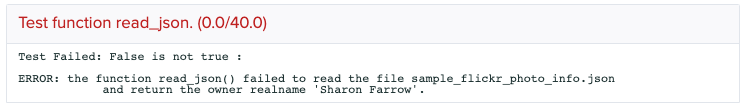
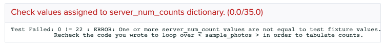
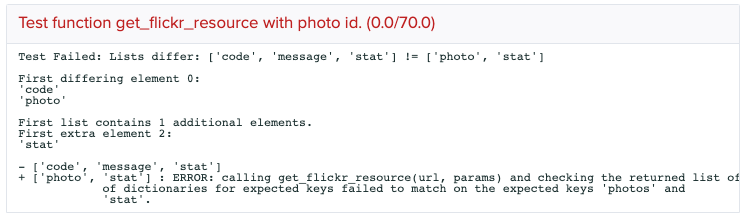
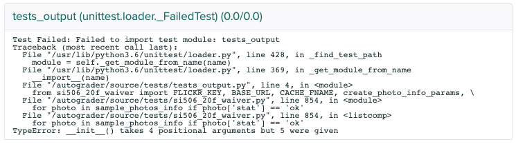
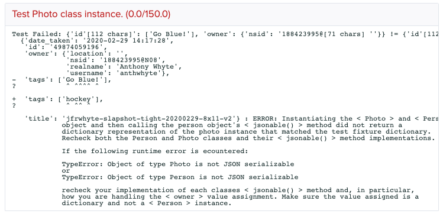
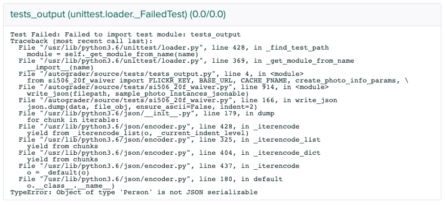

# SI 506 WAIVER ASSIGNMENT

## 1.0 Preliminaries

[SI 506 Programming I](https://www.si.umich.edu/programs/courses/506) is designed for graduate
students with little or no programming experience. SI 506 together with SI 507 (Intermediate
Programming) constitutes an introductory course series that focuses on programming fundamentals.
SI 506 is a prerequisite for most other SI courses that have a computing component, including most
mastery courses.

Students with technical backgrounds (an undergraduate degree in CS or related field, programming
classes elsewhere, or those who have had a job as a programmer or engineer) should try to waive
SI 506 in order to enroll in SI 507 or another course featuring more advanced technical skill
requirements.

The waiver assignment for SI 506 is a single programming assignment that covers most (though not
all) of the topics that SI 506 covers, concepts that you will need to know to enroll in SI 507 or
other more advanced computing courses.

:exclamation: __If you plan to also waive SI 507 Intermediate Programming, you should submit the SI
507 waiver assignment only. Students who waive SI 507 will automatically waive SI 506. Note that a
course waiver does not reduce the credits required for a student’s degree, but enables students to
take a more advanced course or choose another course of interest.__

### 1.1 Sign up

To be considered for the SI 506 waiver, you must first complete the Google sign up
[form](https://docs.google.com/forms/d/1nBJUyvv1wZnNG8NllQTwp0L8bDEtgfh9ihQZp064Gnc/prefill) in order
to be granted access to the assignment. If you do not complete this form, you will not be considered
for the waiver.

### 1.2 Deadline

:warning: The SI 506 Programming I waiver assignment submission is due no later than Monday,
June 22, 2020, 9:00 am EDT. Submissions must be made to
[Gradescope](https://www.gradescope.com/courses/137284) and pre-approval as described above is
required before access to the site is provided.

### 1.3 File locations

The waiver exam assignment template file and a copy of this README can be found under
[Files](https://umich.instructure.com/courses/400847/files/folder/SI%20506) in the Canvas
[UMSI Course Waivers](https://umich.instructure.com/courses/400847) site.

* Template file: `si506_20f_waiver.py`
* Guide: `si506_20f_waiver_README.pdf`

Download the files. Review carefully both the guide (a copy of this README) and the instructions in
the template file before commencing the assignment.

:bulb: The template file, README, and several install guides can also be found in the
[SI506-2020Summer](https://github.com/umsi-arwhyte/SI506-2020Summer) Github public repository.

### 1.4 Self-study preparation

You are free to use any source-code text editor to complete the assignment (we recommend
[VS Code](https://code.visualstudio.com/)). We assume that you are capable of installing both
Python 3.x as well as your source-code editor of choice. We also assume that you are familiar with
`pip`, Python's de facto package manager as you will need to use it to download and install the
[requests](https://pypi.org/project/requests/) library in order to issue HTTP GET requests to the
Flickr API.

There exist an abundance of self-study resources on Python programming that you can access for free
via the internet. Given the time constraints imposed by the waiver exam period, enrollment in and
completion of a MOOC course such as Coursera's
[Python for Everybody Specialization](https://www.coursera.org/specializations/python) or
[Python 3 Programming Specialization](https://www.coursera.org/specializations/python-3-programming),
both of which have been developed by UMSI faculty, is not realistic. However, sites such as
[Real Python](https://realpython.com/) or
[Digital Ocean](https://www.digitalocean.com/community/tutorials?q=python) contain useful articles
and tutorials on a variety of introductory topics that are germane to this waiver exam assignment.

A number of free texts are also available. See

* Paul Resnick et al, [Python 3](https://www.programsinformationpeople.org/runestone/static/publicpy3/)
* Charles Severance, [Python for Everybody](https://www.py4e.com/book.php)
* Lisa Tagliaferri, [How to Code in Python](https://do.co/python-book-pdf)

You should also familiarize yourself with the
[Flicker API](https://www.flickr.com/services/developer/api/) and the Python standard library's
[json](https://realpython.com/python-json/) module and the third-party Python
[requests](https://realpython.com/python-requests/) library.

And, of course, you can consult the Python Software Foundation's offical
[documentation](https://docs.python.org/3/).

### 1.5 Questions

For clarifying questions about the instructions or concepts, head to
[Piazza](https://piazza.com/class/kb2xg1pgdr356), a Q/A platform that you can use to pose questions
about the waiver exam assignment.

:warning: Please __do not__ post code snippets or screenshots of your code on Piazza when asking
questions. Doing so represents code sharing which is prohibited. Instead describe your issue in
writing.

If you need an instructor to have a look at your code send a __private__ message to the instructor.
That said, we limit our replies to offering hints and clarifications only, no answers.

:bulb: if you encounter an issue with the assignment or the autograder deployed to Gradescope
let us know by posting a message on Piazza.

## 2.0 The Challenge

The waiver exam programming assignment assesses your ability to work with lists, dictionaries, and
nested data structures, implement functions and classes, retrieve data from the
[Flickr](https://www.flickr.com/) image hosting platform API, and read from and write to JSON files.

The waiver exam assignment includes the following sections:

* Setup
* Reading Files
* Writing to Files
* Working with Lists and Dictionaries
* Search Flickr
* Get Flickr Photo Info
* Working with Class Instances

If you start the waiver exam assignment and conclude that it is beyond your current abilities--no
problem, stop working on it and resume your other summer activities. SI 506 is probably the right
course for you and we look forward to helping you enhance your progamming skills in the Fall.

### 2.1 Setup

* Install [Python 3.x](https://www.python.org/downloads/)
* Install the [requests](https://requests.readthedocs.io/en/master/) package using `pip`.
* Create a Flickr account and obtain a [non-commercial Flickr API key](https://www.flickr.com/services/apps/create/apply)

### 2.2 Obtaining a Flickr API key

If you do not already have a Flickr account create one per the sign up
[directions](https://help.flickr.com/en_us/sign-up-for-a-flickr-account-B1Mc3mskX). Once you have
activated your account apply for a
[NON-COMMERCIAL flickr API KEY](https://www.flickr.com/services/apps/create/noncommercial/?).
Provide a name for the "app", e.g., "si506_waiver" and a short description (e.g., "Course waiver
exam"). Then check the acknowledgement checkboxes and click SUBMIT.

Once you have obtained your key assign the string value to the constant `FLICKR_KEY` in the
template waiver exam assignment file `si506_20f_waiver.py`.

:warning: As a general rule do not share your API keys with others. In this case we need to test
your setup so include the key value in your submission. Once we have scored your submission we
recommend that you delete the "app" (which deletes the associated API key) and apply for a new
non-commercial flickr API key.

## 3.0 Writing Code

### 3.1 Template file

The Python template file `si506_20f_waiver.py` is where you will write your code. Read the
instructions embedded in the comments carefully and implement the required code as directed.

:warning: do not replace required variable names with names of your own choosing. The auto grader
is designed to import your file as a module in order to reference the classes, functions and
variables by expected names. If you change expected class, function, and variables names you will
fail tests.

### 3.2 Template file text conventions

Code comment references to classes, functions, variables, arguments, and
file names are bounded by '<' name '>' as an aid to identification. Drop the '<' and '>' when
using the names in your code.

### 3.3 Placeholders

You will insert your code into the template file `si506_20f_waiver.py` whenever you encounter lines
that employ the following conventions:

| Code | Placeholder |
|:---- | :---------- |
| functions / class methods | Use of the `pass` statement together with a trailing comment `# TODO replace` |
| function / class method parameters | use of the comment `# TODO fix` trailing the function or method definition |
| variables | assigned the value `None` together with a trailing comment `# TODO replace` |

:exclamation: You MUST replace these placeholder values and statements with your code.

#### 3.3.1 Placeholder example: missing method parameters

```python
def __init__(self): # TODO fix
```

#### 3.3.2 Placeholder example: function implementation

```python
def read_json(filepath):
    """Reads a JSON document and returns a list or dictionary if provided with
    a valid filepath.

    Parameters:
        filepath (str): path to file.

    Returns:
        dict: dictionary representations of the decoded JSON document.
    """

    pass # TODO replace
```

#### 3.3.3 Placeholder example: variable assignment

```python
photo_thames_lit = None # TODO replace
```

## 4.0 Scoring

### 4.1 Gradescope

We employ the [Gradescope](https://www.gradescope.com/) platform and custom autograder code written
in Python to score waiver exam assignment submissions. The Gradescope SI 506 waiver exam assignment
site is located at

https://www.gradescope.com/courses/137284

We will create a Gradescope account for you using your first name, last name, and UMich email
address. You should receive an email notification from Gradescope after your account has been
created.

### 4.2 Earning points

You must score 850 out of a maximum 1000 points to pass the waiver exam assignment. You score
points by uploading your work to Gradescope and passing a series of autograder tests.

### 4.3 Autograder

The autograder will score each submission that you upload. You will earn points for every test that
you pass. Gradescope will replace your prior score (if any) with the current score.

:warning: Gradescope operates on a *last score wins* strategy. In other words, the latest submission
score replaces the prior score even if the new score is lower. Keep that in mind as you organize
your work and testing.

### 4.4 Submissions

There is no limit to the number of times that you may submit your updated `si506_20f_waiver.py` file
to Gradescope prior to the close of the exam period. However, no late submissions will be accepted.

:exclamation: The only file that you are required to submit to Gradescope is your copy of
`si506_20f_waiver.py`. Please submit no other files.

### 4.5 Pass/Fail notification

After the close of the waiver exam, the UMSI Registrar Team will notify students officially about
their waiver outcome status.

## 4.6 Testing your code

Make frequent use of the built-in `print()` function to check values (you can comment out these
lines before submitting your work). You should also use the Gradescope autograder to test your code.
Recall, that there is no limit to the number of times that you can submit your work to Gradescope
for evaluation prior to the close of the exam period.

### 4.7 Autograder test failures

You are likely to fail tests, sometimes repeatedly, after submitting your work to Gradescoope for
scoring. Don't let test failures discourage you. As you finish working on the various sections of
the waiver exam assignment and submit your work for evaluation the number of points you earn should
increase as the number of test failures decline.

:bulb: See below Appendix A. Auto Grader Tests for a list of all tests and the functions and classes
that you must implement for each particular test.

The Gradescope Autograder Results page will list both passing and failing tests and points earned.
Failed tests will be accompanied by a short error description, examples of which are illustrated
below:

#### 4.7.1 File read error



#### 4.7.2 Counting error



#### 4.7.3 List element mismatches

Interpret as student list (left side) does not equal (!=) the test list (right side). In this
example neither list length nor the individual list elements pass the equality test.



#### 4.7.4 Missing method parameter



#### 4.7.5 Dictionary value mismatch

Interpret as student dictionary (left side) does not equal (!=) the test dictionary (right side). In
this example the `tags` value `['Go Blue!]` != `[hockey]`.



#### 4.7.6 write_json() / json.dump() serialization error

This TypeError occurs whenever you attempt to encode a custom type by passing it to
`json.dump()` for encoding as JSON prior to writing the serialized object to a file. In this
example, an instance of the `Person` class (a custom type) was passed to the function `write_json()`
and then on to `json.dump()` for encoding. The runtime error occurred because the `json` module is
designed to work with standard types rather than custom types. To avoid raising this exception pass
instead a JSON-friendly dictionary representation of the `Person` instance to `write_json()`.



## Appendices

### Appendix A. Auto Grader Tests

Below is a list of the unit tests that the autograder runs. Note that autograder tests the code
that you write to perform tasks. If classes and/or functions are not implemented or implemented
incorrectly tests will fail. Note that the tests build upon one another. For a test to succeed,
you _must_, at a minimum, implement all functions as well as classes required by the test.

| Test name | Required functions | Notes |
| :-------- | :----------------- | :---- |
| test_base_url | none | Value assignment check |
| test_cache_fname | none | Value assignment check |
| test_flickr_key | none | Value assignment check |
| test_read_json | read_json() | Function implementation check |
| test_write_json_sample_photo | read_json(), write_json() | Function implementation check |
| test_get_photos | get_photos(), read_json(), write_json() | Function implementation check |
| test_sample_photos_count | get_photos(), read_json() | Working with lists |
| test_sample_photos_slice | get_photos(), read_json() | Working with lists |
| test_sample_photos_bridge | Working with lists; conditional statement | Working with lists |
| test_sample_photos_server_groups | get_photos(), read_json() |Working with lists and dictionaries; conditional statements |
| test_get_photo_ids | get_photos(), get_photo_ids(), read_json() | Function implementation check |
| test_get_resource | create_photo_search_params(), get_resource() | Function implementation check |
| test_get_cache | get_cache(), read_json() | Function implementation check |
| test_cache_has_item_mountain | create_photo_search_params(), get_cache(), get_flickr_resource(), get_resource(), read_json() | Function implementation, data retrieval, and caching checks |
| test_create_photo_search_params | create_photo_search_params | Function arguments check |
| test_get_flickr_resource_search | create_photo_search_params(), get_cache(), get_flickr_resource(), get_photos(), get_photo_ids(), get_resource(), read_json() | Data retrieval workflow, caching, and data structure checks |
| test_mountain_photos | create_photo_search_params(), get_cache(), get_flickr_resource(), get_photos(), get_resource(), read_json() | Data retrieval workflow, caching, and data structure checks |
| test_mountain_photo_id | create_photo_search_params(), get_cache(), get_flickr_resource(), get_photos(), get_photo_ids, get_resource(), read_json() | Data structure checks |
| test_cache_has_item_alps | create_photo_search_params(), get_cache(), get_flickr_resource(), get_resource(), read_json() | cache item check |
| test_get_flickr_resource_alps_photo_info | create_photo_search_params(), create_photo_info_params(), get_cache(), get_flickr_resource(), get_photos(), get_photo_ids, get_resource(), read_json() | Data retrieval workflow, caching, and data structure checks |
| test_get_flickr_resource_photo_info | create_photo_search_params(), create_photo_info_params(), get_cache(), get_flickr_resource(), get_photos(), get_photo_ids, get_resource(), read_json() | Data retrieval workflow, caching, and data structure checks |
| test_person_class | create_photo_info_params(), get_cache(), get_flickr_resource(), get_resource(), read_json() | Person class implementation and instantiation, __init__() and __str__() method checks |
| test_photo_class | create_photo_info_params(), get_cache(), get_flickr_resource(), get_resource(), read_json() | Photo (and Person) class implementation and instantiation, __init__(), get_web_page_url(), and __str__() methods called |
| test_sample_photo_instance | create_photo_search_params(), create_photo_info_params(), get_cache(), get_flickr_resource(), get_photos(), get_photo_ids, get_resource(), read_json() | Working with lists, type checking |
| test_sample_photo_instances_jsonable | create_photo_search_params(), create_photo_info_params(), get_cache(), get_flickr_resource(), get_photos(), get_photo_ids(), get_resource(), read_json() | class instance jsonable() method check |
